# How to

## Apex Runner

In order to run anonymous apex code, you can use apex runner.
It is usefull to launched a batchable or a queuable. The log result will be poll during 15 min and can be resumed if needed.


Then you can check result on log and go to log analyzer to analyze it.


The results area has 4 tabs: **Logs** (executed scripts and their logs), **Jobs** (batch/queueable jobs), **Tests** and **Coverage**.

- Use **Delete all logs** to clear old ApexLogs from the org, and **Open empty logs** to open the log viewer without running anything.
- Click **Run Unit Tests** to run all tests in the org (confirmation required); results appear in the Tests tab and code coverage per class in the Coverage tab, with lines highlighted in red where coverage is below 75%.

## Clone a User

From the extension's Users tab, select an active user and click **Clone**. Enter a unique username, then enter the user's email address. The email prompt defaults to the username but can be changed independently. Complete the first-name and last-name prompts to create the user with the source user's writable fields and assignments.

## Popup search filter checkboxes

The Objects, Users and Shortcuts quick-search tabs in the popup each have filter checkboxes (all enabled by default) to narrow results:

- Users: "Include inactive users" and "Include portal users".
- Objects: "Object schema" and "Records" (recently viewed records for that object).
- Shortcuts: "Flows", "Profiles", "Permission Sets", "Communities" and "Apex classes".

## User tab actions

Selecting a user in the popup's Users tab shows, in addition to Enable Log:

- **Clone**: clone the current user with all permission set, permission set group, profile and role, a popup will ask you username.
- **Login as Incognito**: opens a "Login As" session for that user in a new incognito/private window instead of the current one.
- **Reset Password**: prompts for confirmation, then resets the user's password (shown only for active users).
- **Enable/Disable LC debug mode**: toggles Lightning (Aura/LWC) component debug mode for that user.

## Export a List View

While viewing a list view in Salesforce, the popup shows an **Export List View** button (shortcut `L`) that downloads the list view's rows as CSV.

## Convert a Salesforce Report to a SOQL query (Beta)

While viewing a Report record in Salesforce, the popup's **Export** button opens Data Export pre-filled with an equivalent SOQL query built from the report's columns, filters and groupings, so you can tweak and re-run it directly.

## log analyzer

The analyzer has 5 tabs:

- **Raw log**: displays the raw log and lets you search keywords in it.

  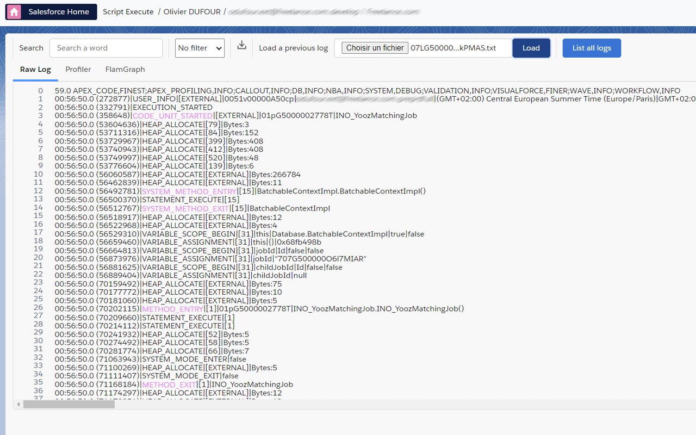

- **Profiler**: a treeview to analyze the log in detail, useful to troubleshoot any issue when you reach an org limit such as DML, SOQL, callout or CPU time.

  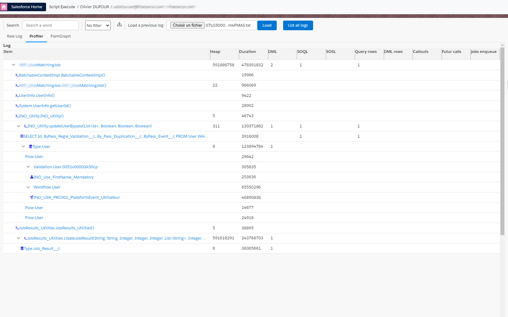

- **Flame graph**: for CPU limit exceptions (duration over 10 seconds), visualize where time is spent.

  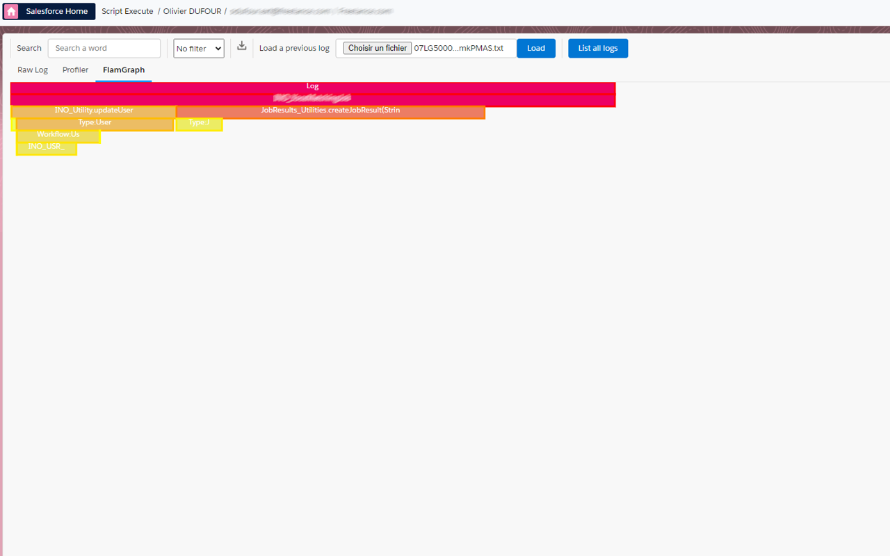

- **Apex**: pick an Apex class from the dropdown to view its source with line numbers; lines that produced log output are highlighted, click one to see the matching log lines on the right (and click a log line to jump back to it in the Raw log tab).
- **Ressource**: lists every distinct SOQL, SOSL, DML and callout found in the log with an occurrence count; click one to jump to it in the Raw log tab. Use the filter dropdown to narrow it to one kind (CALLOUT/SOQL/SOSL/DML).

## Org Analyzer

Open it from the popup and go to the "Org Analyzer" button. It scans your org for security, code-quality, unused-resource, migration and maintainability issues (e.g. too many validation rules/triggers per object, SOQL/DML in loops, hardcoded IDs, SOQL injection risks, Apex classes without an explicit sharing model, unreferenced Apex classes, Process Builder/Workflow candidates for Flow migration, Visualforce/Aura candidates for LWC migration, too many system admins, deep role hierarchies, inactive users, over-permissioned Connected Apps, and more).

1. Check/uncheck the rules you want to run (or "Select all"), then click **Analyze org**.
2. Results stream in as each rule completes; use the priority dropdown (1-5) to filter, and **Stop** to cancel a long-running scan.
3. Click the download icon to save the results as a CSV.

> **Warning**
> The Org Analyzer makes extensive API calls. Monitor your org's API limits and save results via the CSV download for later reference.

## Flow Analyzer

While viewing a Flow in Flow Builder, open the extension popup and click **Analyze Flow** to open a report of potential issues found in the flow's metadata: performance (DML/action calls in loops, Get Record fetching all fields), best practices (missing description, unused variables, unconnected elements, not using Auto Layout), security & reliability (hardcoded IDs/URLs, missing fault paths or null handlers), maintainability (high cyclomatic complexity, naming convention violations, old API version, too many versions) and logic issues (recursive triggers, same-record field updates). Each finding shows a severity (error/warning/info), a message and, where relevant, the list of affected elements.

**Describe Flow with AI** (next to Analyze Flow in the popup) is a separate feature: it sends the flow's metadata to your configured AI provider to get a plain-language description — see [AI Assistant](#ai-assistant) below for setup.

## Dependency Viewer

Open it from the popup. Pick a metadata **Type**, then start typing in **Component Name** for autocomplete suggestions, then click **Get Parent Dependencies** (what uses this component) or **Get Child Dependencies** (what this component uses) to build a hierarchical dependency tree (flows are scanned for subflow references too, shown as a progress indicator while running). Once you have results, click **Export package.xml** to download a `package.xml` covering the whole dependency tree, ready for the sf CLI.

## Platform Event Manager (Streaming)

Open it from the popup ("Streaming" button). It has 5 tabs:

- **Monitor**: shows every event received since the page opened. Filter results with the search box, narrow to one event type with the dropdown, restrict to a date/time range with the start/end date pickers (based on the event's `CreatedDate`), and use the download icon to export captured events as CSV.
- **Subscribe**: pick an event type (Platform Event, Generic Event, Change Data Capture, PushTopic, Real-Time event, ...) and a topic/channel, then click **Subscribe**. Active subscriptions are listed below with a delete icon to unsubscribe. Real-Time event topics are fetched from the org's `RealTimeEvent` object, listing only entities with monitoring currently enabled.
- **Publish**: pick a Platform Event or Generic Event channel, type a JSON payload and click **Publish**; the raw API response is shown below.
- **Create**: register a new PlatformEventChannel, PlatformEventChannelMember or PushTopic (with its SOQL query and Create/Update/Undelete/Delete notification flags) without leaving the page.
- **Graphic**: shows the same events as Monitor rendered as a flame-graph timeline (one bar per event, positioned by `CreatedDate`), updating live as new events arrive.

## SOSL

In data Export, you run an SOSL query in order to retreive some data across multiple objects:


## Assignment rules

In data import, you can choose to use assigment rules or not for lead, case and even Account (territory management).

## Data import: Bulk API, hard delete and retrying failures

- The **API Type** dropdown includes **Bulk**, for large import/update/delete jobs, in addition to the standard REST/Tooling APIs.
- The **Action** dropdown includes **Hard Delete** (permanently deletes records, bypassing the recycle bin), available with the Bulk API.
- After running an import, failed rows are marked in the results (with a status/error column); fix the data directly in the input and click **Retry Failed** to resubmit only the rows that failed.

## Inspect: Field Usage Analysis and search keywords

On the Inspect page, open an object then click the actions menu (the down-arrow button next to New/Export/More) and select **Show field usage** to see, for every field on the object, the percentage of records that have a value populated — useful for finding unused or underutilized fields.

The field/object search box also matches against a field's formula or roll-up summary definition (so searching part of a formula finds the field that uses it), and supports the special keyword **Stored field** to list only plain fields (not formulas, not roll-up summaries).

## SOQL editor and data export

The SOQL editor support color, suggestion over text, and we have fixed a lot of issue in suggestion of original Salesforce inspector (subquery object name, subquery field suggestion, in list suggestion, __r suggest all custom relation, ...)

GraphQL queries (e.g. `{ uiapi { query { Account { edges { node { Name { value } } } } } } }`) also get keyword, object and field suggestions and syntax highlighting, including:

- relationship fields (e.g. `Account { Name { value } }`) and child-relationship sub-queries (e.g. `Contacts { edges { node { ... } } }`)
- `where`, `orderBy`, `first` and `after` arguments on an object, e.g. `Account(where: { Industry: { eq: "Energie" } }, orderBy: { Name: { order: ASC } }, first: 10)`
- `aggregate` queries (e.g. `{ uiapi { aggregate { Opportunity { edges { node { aggregate { Amount { avg { displayValue } } } } } } } } }`)

Suggestion clicks insert already-balanced braces so you don't have to close them by hand. `and`/`or` combinator arrays in `where`, grouping fields alongside an `aggregate` selection, and "Format Query" are not supported for GraphQL yet.

Technical column (done, count, object type) can be skipped with an option.

Date format and date time format is now customizable in option. So data can fit directly to your need.
By the way, Data import date format can be customized too.

## AI Assistant

Configure an AI provider from Options > API tab, "Integration with AI (SOQL & Apex Generation)": pick a **Default AI Provider** (OpenAI/ChatGPT, Mistral AI, Anthropic/Claude, or AgentForce/Salesforce Einstein) and enter that provider's API key (get one from the linked OpenAI/Mistral/Claude console pages). For AgentForce, Prompt Builder must be enabled in Setup; the option panel can auto-import and configure the three required prompt templates ("GenerateSOQL", "AnalyzeFlow" and "GenerateApex") for you, or you can point it at your own template names.

Once configured, AI is available from:

- Data Export: click **🤖 Generate with AI** next to the query editor to generate a SOQL query from a natural-language description.
- Apex Runner: click **🤖 Generate with AI** next to the script editor to generate an anonymous Apex script from a natural-language description. Type `@` in the prompt to search and insert an Apex class or a Salesforce object by name; the AI is given that class's source (or that object's fields) as context so the generated script references it correctly.
- Flow Builder (via the popup, on a flow page): click **Describe Flow with AI** to get a plain-language description of the open flow.

## Batch/list query parameters, Bulk API and query tools

In Data Export, next to the query editor:

- **Format Query**, **Export Query** (copies a shareable query URL) and **Query Plan** (runs Salesforce's Query Plan API on the query) are available as buttons above the editor.
- Click the toggle icon (title "Use list parameter in query") to open **Batch Parameters**: paste one value per line (quote text values), set a **Batch size**, then reference the pasted list as `$1` in the query, e.g. `...WHERE Id IN ($1)` — the query re-runs once per batch of pasted values.
- The **API Type** dropdown next to the query lets you run the query via **Query** (standard REST), **Tooling** (metadata) or **Bulk** (for large datasets; download only, no inline result grid).

## Query history and saved queries

The **History** and **Favorite** dropdowns above the query editor (also available in Apex Runner) let you manage past and saved queries:

- Click the pencil icon to **rename** an entry, the chevron to expand/collapse and preview its full query text, and the trash icon to delete it.
- Add or remove **tags** on a saved query directly from the list (type a tag and press enter; click the "x" on a tag to remove it).
- Type a **Query Label** and click **Save Query** to add the current query to Favorites.

## Sort, filter and copy data export results

- Click the sort icon (▼▲) in a column header to sort by that column; click again to reverse the order.
- Click into the "Filter Results" box to reveal a field dropdown and an operator dropdown (Contains, Equal, Not equal, Starts With, Ends With) to filter the result grid on a specific column, including computed/non-queryable columns.
- Selecting and copying result cells also copies an HTML representation, so pasting into Excel, Word, Jira and similar tools preserves the table structure (not just plain text).

## Data export inline edit and picklist

On Data export, you can dit directly a field by double clicking on cell. Id must be present on SOQL and only field of main object is editable.
For picklist, a list of picklist value is displayed with auto suggestion.
A single click on a cell copies its value to the clipboard (the cell briefly flashes green to confirm).


## Use Sf Inspector with an External Client App

---

If you enabled "API client whitelisting" (a.k.a "API Access Control") in your org, SF Inspector may not work anymore.

To secure the extension usage, you can use a OAuth 2.0 web server flow to get an access token, linked to a external client app installed in your org. (it replace the Connected App obsolete in spring 2026)

To create the "SF Inspector Advanced" external client app:

1. Navigate to Setup `External Client App Manager` , and click `New External Client App`
2. Fill `External Client App Name`, `Contact Email`, set `Distribution State` to local
3. Expand `API (Enable OAuth Settings)` section then check `Enable OAuth`
4. Set callback url to `{browser}-extension://{chromeExtensionId}/data-export.html` (replace `{chromeExtensionId}` by the actual ID of the extension in your web browser you can check with url of data export (example: chrome: `dbfimaflmomgldabcphgolbeoamjogji`, firefox: `6b1e983e-4f0f-4519-afb2-81d0213341d7`) and browser with `moz` for firefox and `chrome` for chrome).
5. Select oauth scopes : `Manage user data via APIs (api)` and `Manage user data via web browsers (web)`

   > **Warning**
   > Don't forget to replace "chromeExtensionId" with your current extension Id
   > 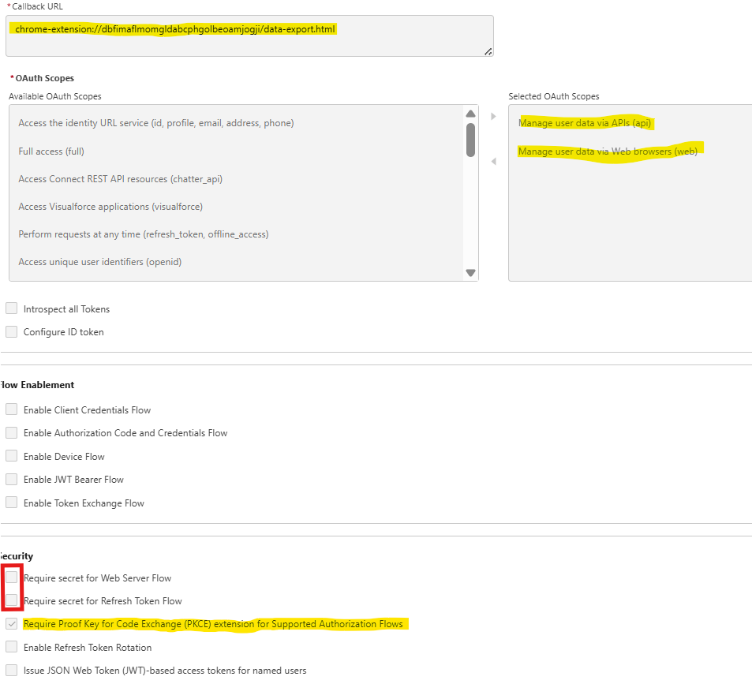
6. Deselect `Require secret for Web Server Flow` and `Require secret for Refresh Token Flow`
7. Select `Require Proof Key for Code Exchange (PKCE) extension for Supported Authorization Flows` and leave other checkbox to default
8. Save
9. Go to `Settings` tab then open OAuth Settings section then Click `Consumer Key and Secret` button
10. enter verification code
11. copy the Consumer Key then open the option page

   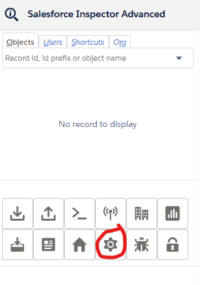

12. Go to `API` tab and paste the consumer key in field `consumer key`

   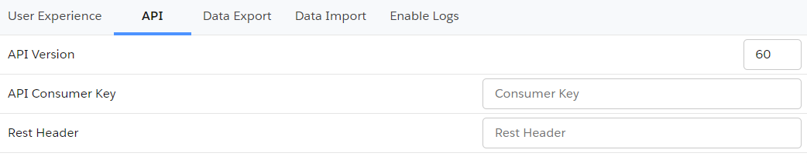

13. Refresh page and generate new token

   

## Migrate saved queries from legacy extension to Salesforce Inspector Advanced

1. Open data export page on legacy extension
   
2. Get saved queries from `insextSavedQueryHistory` property
   
3. Open it in VS Code, you should have a JSON like this one:

   ```json
   [
     { "query": "select Id from Contact limit 10", "useToolingApi": false },
     { "query": "select Id from Account limit 10", "useToolingApi": false }
   ]
   ```

   From there you have two options

   Import the queries by adding a label for each one with the label in query property suffixed by ":"
   ie.

   ```json
   [
     {
       "query": "Contacts:select Id from Contact limit 10",
       "useToolingApi": false
     },
     {
       "query": "Accounts:select Id from Account limit 10",
       "useToolingApi": false
     }
   ]
   ```

Re-import this json in the new extension (with the same key `insextSavedQueryHistory`)

## Define a CSV separator

Add a new property `csvSeparator` containing the needed separator for CSV files

   

## Disable query input autofocus

From popup button, go to option menu, and slect user experience tab to switch off option `disable query input autoFocus`

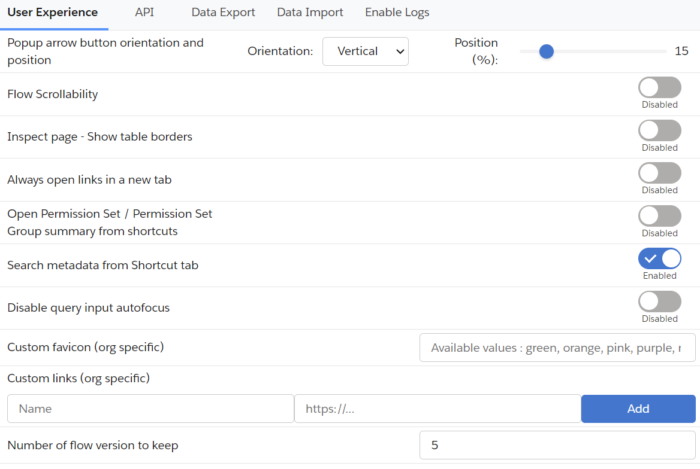

## Add custom query templates

Enter value in "Query Templates" option with your custom queries separated by "//" character.
Example:

`SELECT Id FROM// SELECT Id FROM WHERE//SELECT Id FROM WHERE IN//SELECT Id FROM WHERE LIKE//SELECT Id FROM ORDER BY//SELECT ID FROM MYTEST__c//SELECT ID WHERE`

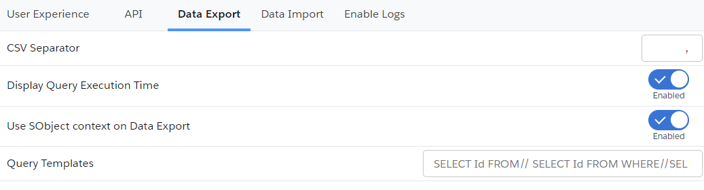

## Open links in a new tab

If you want to _always_ open extension's links in a new tab, open option from popup menu then in user experience tab, you can switch on the `Always open links in a new tab"`


If you want to open popup keyboard shortcuts, you can use the 'ctrl' (windows) or 'command' (mac) key with the corresponding key.
Example:

- Data <ins>E</ins>xport : e
- Data <ins>I</ins>mport : i
- Org <ins>L</ins>imits : l
- <ins>D</ins>ownload Metadata : d
- E<ins>x</ins>plore API : x

## Disable metadata search from Shortcut tab

By default when you enter keyword in the Shortcut tab, the search is performed on the Setup link shortcuts _AND_ metadata (Flows, PermissionSets and Profiles).
If you want to disable the search on the metadata, you can go to options then on user experience tab, switch off `Search metadata from Shortcut tab` 


## Enable / Disable Flow scrollability

Go on a Salesforce flow and check / uncheck the checbox to update navigation scrollability on the Flow Builder on the header bar. You can modify it too inside option on user experience tab by switching `Flow Scrollability`.

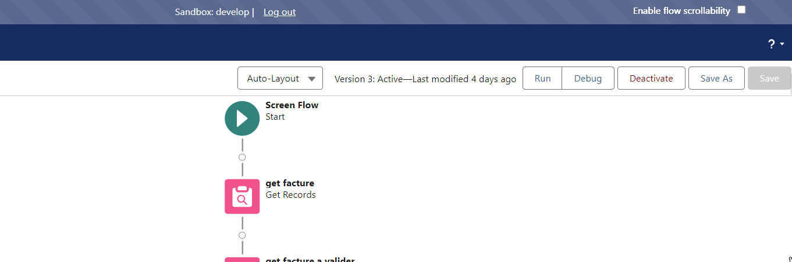

## Clear old Flow versions

Go on a Salesforce flow, open the extension popup and click the `Clear old flow versions` button (next to `Analyze Flow`, `Where it is used` and `Version Details`) to delete flow versions older than the `Number of flow version to keep` option. You can modify `Number of flow version to keep` option on user experience tab.

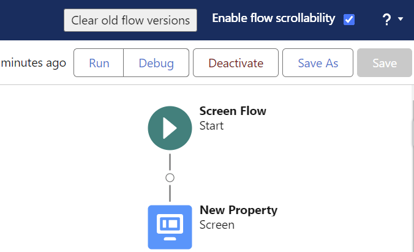


## Add custom links to "Shortcut" tab

Because one of the main use case for custom links is to refer to a record in your org, those links are stored under a property prefixed by the org host url.
You can add or remove custom link under option Menu then User experience tab:
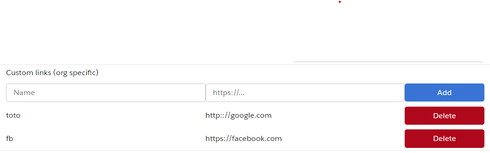

Then copy the url and add `_orgLinks` for the property name.
Now you can enter the custom links following this convention:


ET VOILA !

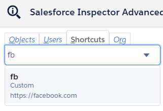

## Enable summary view of PermissionSet / PermissionSetGroups from shortcut tab

Since Winter 24, there is a beta functionality to <a href="https://help.salesforce.com/s/articleView?id=sf.perm_sets_summary_page.htm" title="view Pset summary">view a summary of the PermissionSet / PermissionSetGroups</a>


You can enable this view for the Shortcut search by going to options, on user experience tab then switching on the option `Open Permission Set / Permission Set Group summary from shortcuts` 


Then when you click on a PermissionSet / PermissionSetGroups search result, you'll be redirected to the summary.

## Customize Create / Update rest callout headers (to prevent execution of auto assignment rules for Accounts, Cases, or Leads)

[Assignment Rule Header](https://developer.salesforce.com/docs/atlas.en-us.api_rest.meta/api_rest/headers_autoassign.htm)

From the popup, click on "Options" button and select the API tab.


If you want to prevent auto assignment rules, set the `createUpdateRestCalloutHeaders` property to `{"Sforce-Auto-Assign" : false}`

## Update API Version

Since the plugin's api version is only updated when all productions have been updated to the new release, you may want to use the latest version during preview windows.

> [!IMPORTANT]
> When you manually update the API version, it won't be overriden by extension future updates.

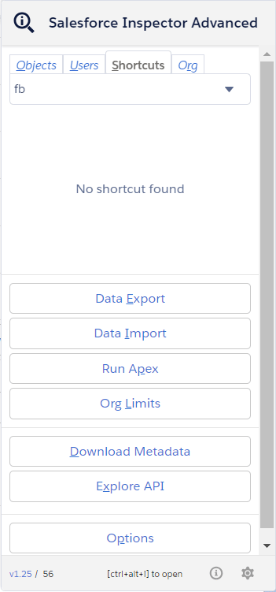

## Download Event Log Files

To make your life easier and avoid third party tools or login to ELF website, we implemented the download option from the data export page.
When quering EventLogFile, add the "LogFile" field in the query and click on the value to download corresponding log.

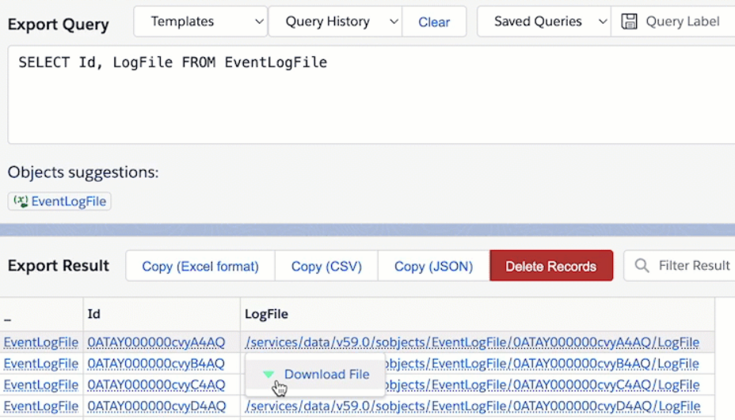

## Enable debug logs

Sometimes you may want to enable logs for a particular user.
From User tab, click the "Enable Log" button.

By default, this will enable logs with level "SFDC_DevConsole" for 15 minutes.

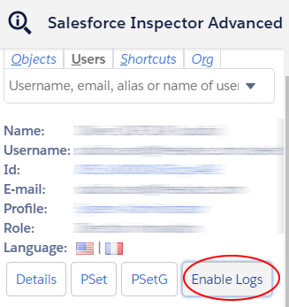

You can update the debug level (configuration is per organization) and duration (for all organizations) on the Options page.

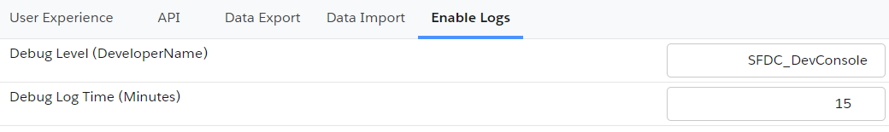

> **Warning**
> Increasing the default duration may lead to a high volume of logs generated.

## Display query performance in Data Export

To enable performance metrics for queries on the data export page, open the Options screen and select the Data Export tab,
then set "Display Query Execution Time" to enabled. Total time for the query to process and, when applicable, batch stats (Total Number of Batches, Min/Max/Avg Batch Time)
are displayed.

## Auto-select first suggestion in Data Export

By default, when the SOQL/SOSL/GraphQL autocomplete list is displayed on the Data Export page, no suggestion is highlighted until you press an arrow key.
To have the first suggestion highlighted automatically as soon as the list appears (so it can be picked directly with Enter or Tab), open the Options screen,
select the Data Export tab, and enable "Auto-select first suggestion" (disabled by default).

## Explore API

Open it from the popup ("Explore API" button). Pick an HTTP method and enter the API URL (e.g. `/services/data/v59.0/graphql`), set headers and a request body (JSON, raw or CSV depending on the call), then run the request — response time is measured and shown with the result.

- The **Templates** dropdown has ready-made requests to start from: Services list, Update account (REST), a SOQL query, a GraphQL query, deploy status, Bulk API create/insert/finish job, Chatter news feed, Report data, and Platform Event Channel / Channel Member creation.
- Past calls are kept in a **History**, and you can **save** a request for reuse later; small responses are stored with the history entry.

Example GraphQL query to try (via the "GraphQL" template or pasted directly as the body with method POST):

`{ "query": "query accounts { uiapi { query { Account { edges { node { Id  Name { value } } } } } } }" }`

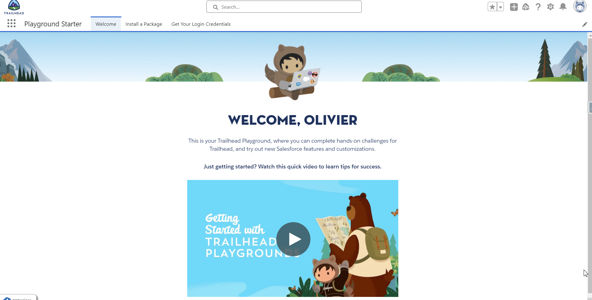

## Customize extension's favicon

From the option page, you can customize the default favicon by:

- a predefined color among those values (green, orange, pink, purple, red, yellow)
- a custom favicon url (ie "https://stackoverflow.com/favicon.ico")

The customization is linked to the org, it means you can have different colors for DEV and UAT env for example.

You can choose to autogenerate color by environment. The same color will be used for Salesforce extension and Salesforce environment but salesforce inspector extension have a different icon. So you can find quickly the right envionment from tab.


## Metadata Retrieve

Open it from the popup ("Download Metadata" button, shortcut `d`). The page is now split into four tabs:

- **Download Metadata**: search & filter metadata to build a selection, then download it as a zip or as a `package.xml` for the sf CLI. Pick one or more metadata types (autosuggest), and optionally narrow the results by metadata name (contains), modified date range (from/to) and who last modified it (autosuggest on user name). Click **Search** to list the matching components, select the ones you want, then download the metadata zip or generate the `package.xml`. You can instead switch to "Upload a package.xml" to drop an existing `package.xml` and download that selection directly, without going through Search.
- **Download Translation**: pick a language and one or more objects (search/select all supported) to download a `CustomObjectTranslation` + global Translations (custom labels, tabs, etc.) zip for that language, similar to Workbench's translation download. If Translations aren't enabled on the org, a warning is shown instead of failing the whole load.
- **Upload Metadata**: drag & drop (or browse to) a metadata zip to deploy it to the org. Deploy Options let you check-only (validate without deploying), allow missing files, ignore warnings, perform a retrieve, and purge on delete.
- **Data Model**: download a CSV export of all objects and fields in the org.

## Formula Helper

A standalone tool for writing and cleaning up Salesforce formulas: syntax highlighting, line numbers, autocompletion of field names, objects and formula functions, and real-time error checks.

- Open it from the floating Inspector button's toolbar (shortcut `y`).
- Pick an object at the top of the page to get field autocompletion (including relationship fields, e.g. typing `Owner.` suggests `User` fields) in addition to function/operator suggestions. Press `Ctrl+Space` to bring up suggestions.
- The **Problems** panel below the editor lists client-side issues found as you type: unclosed/unmatched parentheses, unterminated strings, missing or misplaced commas, and function argument count mismatches. Click a problem to jump to its location in the editor. This is a local, best-effort check that complements — it does not call or replace — Salesforce's own "Check Syntax" button in Setup.
- Click **Format** to pretty-print a nested formula (line breaks and indentation for deeply nested function calls); `Ctrl+Z` undoes it like any other edit.
- Click **Copy result** to copy the current formula to the clipboard, ready to paste into the formula field/validation rule/flow you're editing in Salesforce Setup.
