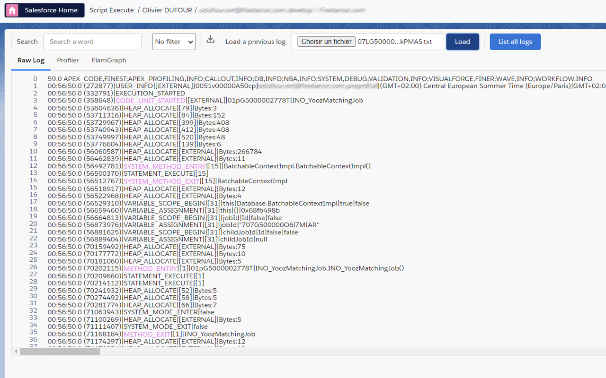
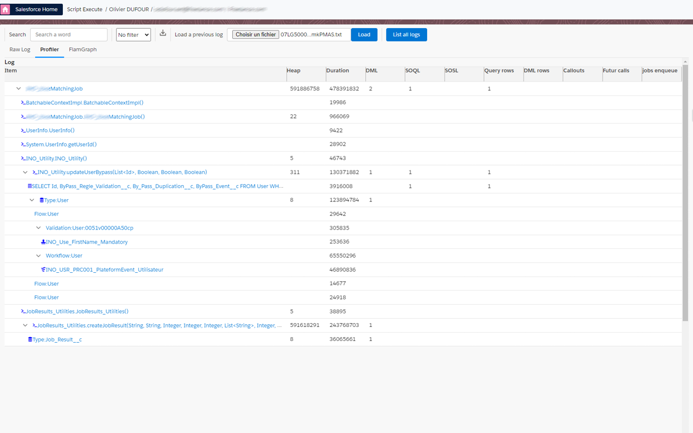
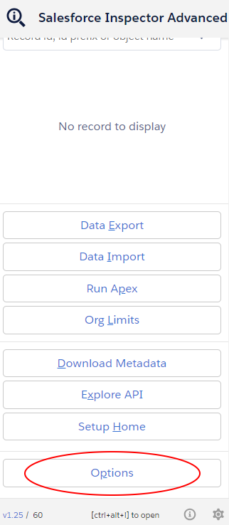
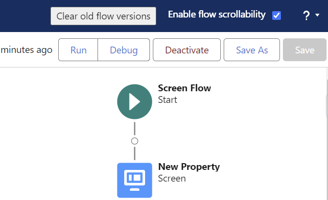
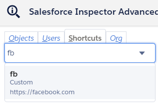
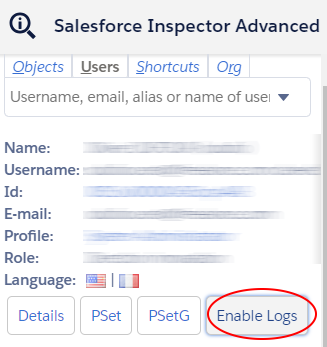
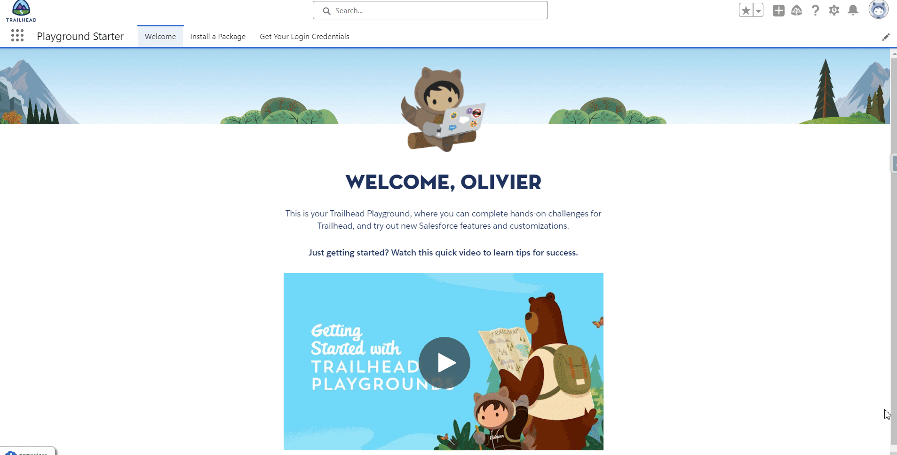

# How to

## Apex Runner

In order to run anonymous apex code, you can use apex runner.
It is usefull to launched a batchable or a queuable. The log result will be poll during 15 min and can be resumed if needed.


Then you can check result on log and go to log analyzer to analyze it.


## log analyzer

The analyzer have 2 tabs. 
The first tab display the raw log and permit to search keyword in it.



The second tab is a profilter and display a treeview to be able to analyze in detail
It permit to troubleshoot any issue when you reach an org limit as DML, SOQL, callout, CPU time. 


## SOSL

In data Export, you run an SOSL query in order to retreive some data across multiple objects:


## Assignment rules

In data import, you can choose to use assigment rules or not for lead, case and even Account (territory management).

## Use Sf Inspector with a connected app

---

If you enabled "API client whitelisting" (a.k.a "API Access Control") in your org, SF Inspector may not work anymore.

To secure the extension usage, you can use a OAuth 2.0 flow to get an access token, linked to a connected app installed in your org.

To install the default "SF Inspector Advanced" connected app, navigate to Setup | Connected Apps OAuth Usage, and click "Install" on the Salesforce Inspector Advanced app.

> **Warning**
> Don't forget to grant access to the users by selecting the related profile(s) or permission set(s).

If you are a Firefox user, or if you want to have full control over the connected app settings, you can also use your own connected app by following these instructions:

1. Create a connected app under Setup | App Manager > New Connected App.
2. Set callback url to `chrome-extension://chromeExtensionId/data-export.html` (replace `chromeExtensionId` by the actual ID of the extension in your web browser). Make sure the "Manage user data via APIs (api)" scope is selected. You can leave other settings to their default values.

   > **Warning**
   > Don't forget to replace "chromeExtensionId" with your current extension Id
   > 

3. Get Consumer Key and save it in the Options page

   

4. Enter the consumer key

   

5. Refresh page and generate new token

   

## Migrate saved queries from legacy extension to Salesforce Inspector Advanced

1. Open data export page on legacy extension
   
2. Get saved queries from `insextSavedQueryHistory` property
   
3. Open it in VS Code, you should have a JSON like this one:

   ```json
   [
     { "query": "select Id from Contact limit 10", "useToolingApi": false },
     { "query": "select Id from Account limit 10", "useToolingApi": false }
   ]
   ```

   From there you have two options

   Import the queries by adding a label for each one with the label in query property suffixed by ":"
   ie.

   ```json
   [
     {
       "query": "Contacts:select Id from Contact limit 10",
       "useToolingApi": false
     },
     {
       "query": "Accounts:select Id from Account limit 10",
       "useToolingApi": false
     }
   ]
   ```

Re-import this json in the new extension (with the same key `insextSavedQueryHistory`)

## Define a CSV separator

Add a new property `csvSeparator` containing the needed separator for CSV files

   

## Disable query input autofocus

From popup button, go to option menu, and slect user experience tab to switch off option `disable query input autoFocus`


## Add custom query templates

Enter value in "Query Templates" option with your custom queries separated by "//" character.
Example:

`SELECT Id FROM// SELECT Id FROM WHERE//SELECT Id FROM WHERE IN//SELECT Id FROM WHERE LIKE//SELECT Id FROM ORDER BY//SELECT ID FROM MYTEST__c//SELECT ID WHERE`


## Open links in a new tab

If you want to _always_ open extension's links in a new tab, open option from popup menu then in user experience tab, you can switch on the `Always open links in a new tab"`


If you want to open popup keyboard shortcuts, you can use the 'ctrl' (windows) or 'command' (mac) key with the corresponding key.
Example:

- Data <ins>E</ins>xport : e
- Data <ins>I</ins>mport : i
- Org <ins>L</ins>imits : l
- <ins>D</ins>ownload Metadata : d
- E<ins>x</ins>plore API : x

## Disable metadata search from Shortcut tab

By default when you enter keyword in the Shortcut tab, the search is performed on the Setup link shortcuts _AND_ metadata (Flows, PermissionSets and Profiles).
If you want to disable the search on the metadata, you can go to options then on user experience tab, switch off `Search metadata from Shortcut tab` 


## Enable / Disable Flow scrollability

Go on a Salesforce flow and check / uncheck the checbox to update navigation scrollability on the Flow Builder on the header bar. You can modify it too inside option on user experience tab by switching `Flow Scrollability`.


## Clear old Flow versions

Go on a Salesforce flow and click on the `Clear old flow versions` button to delete flow versions older than `Number of flow version to keep` option on the Flow Builder on the header bar. You can modify `Number of flow version to keep` option on user experience tab.




## Add custom links to "Shortcut" tab

Because one of the main use case for custom links is to refer to a record in your org, those links are stored under a property prefixed by the org host url.
You can add or remove custom link under option Menu then User experience tab:


Then copy the url and add `_orgLinks` for the property name.
Now you can enter the custom links following this convention:


ET VOILA !



## Enable summary view of PermissionSet / PermissionSetGroups from shortcut tab

Since Winter 24, there is a beta functionality to <a href="https://help.salesforce.com/s/articleView?id=sf.perm_sets_summary_page.htm" title="view Pset summary">view a summary of the PermissionSet / PermissionSetGroups</a>


You can enable this view for the Shortcut search by going to options, on user experience tab then switching on the option `Open Permission Set / Permission Set Group summary from shortcuts` 


Then when you click on a PermissionSet / PermissionSetGroups search result, you'll be redirected to the summary.

## Customize Create / Update rest callout headers (to prevent execution of auto assignment rules for Accounts, Cases, or Leads)

[Assignment Rule Header](https://developer.salesforce.com/docs/atlas.en-us.api_rest.meta/api_rest/headers_autoassign.htm)

From the popup, click on "Options" button and select the API tab.


If you want to prevent auto assignment rules, set the `createUpdateRestCalloutHeaders` property to `{"Sforce-Auto-Assign" : false}`

## Update API Version

Since the plugin's api version is only updated when all productions have been updated to the new release, you may want to use the latest version during preview windows.

> [!IMPORTANT]
> When you manually update the API version, it won't be overriden by extension future updates.


## Download Event Log Files

To make your life easier and avoid third party tools or login to ELF website, we implemented the download option from the data export page.
When quering EventLogFile, add the "LogFile" field in the query and click on the value to download corresponding log.


## Enable debug logs

Sometimes you may want to enable logs for a particular user.
From User tab, click the "Enable Log" button.

By default, this will enable logs with level "SFDC_DevConsole" for 15 minutes.



You can update the debug level (configuration is per organization) and duration (for all organizations) on the Options page.


> **Warning**
> Increasing the default duration may lead to a high volume of logs generated.

## Display query performance in Data Export

To enable performance metrics for queries on the data export page, open the Options screen and select the Data Export tab,
then set "Display Query Execution Time" to enabled. Total time for the query to process and, when applicable, batch stats (Total Number of Batches, Min/Max/Avg Batch Time)
are displayed.

## Test GraphQL query

- Open popup and click on "Explore API" button.
- Right click on the page and select "Inspect"
- Execute the code in dev console:

`var myQuery = { "query": "query accounts { uiapi { query { Account { edges { node { Id  Name { value } } } } } } }" };`
`display(sfConn.rest("/services/data/v59.0/graphql", {method: "POST", body: myQuery}));`



## Customize extension's favicon

From the option page, you can customize the default favicon by:

- a predefined color among those values (green, orange, pink, purple, red, yellow)
- a custom favicon url (ie "https://stackoverflow.com/favicon.ico")

The customization is linked to the org, it means you can have different colors for DEV and UAT env for example.


